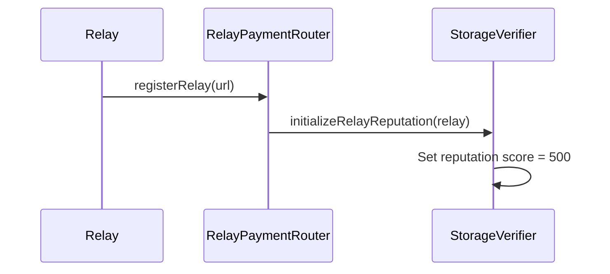
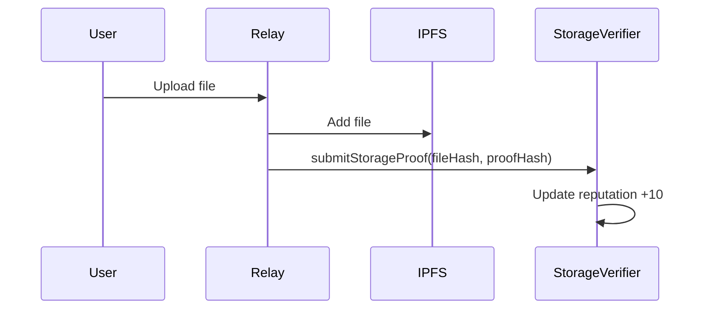
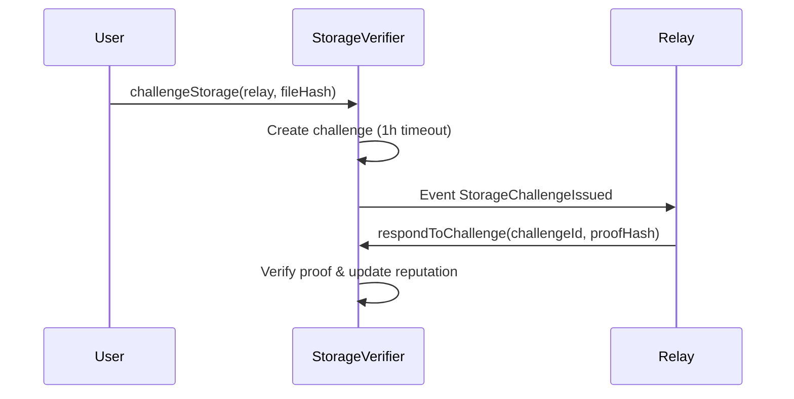

# StorageVerifier Contract

## Panoramica

Il contratto `StorageVerifier` è progettato per verificare che i relay mantengano effettivamente i file IPFS caricati dagli utenti. Implementa un sistema di challenge-response con prove criptografiche e reputazione dei relay.

## Caratteristiche Principali

### 🔐 Sistema di Verifica Storage

- **Proof of Storage**: I relay devono dimostrare di possedere i file
- **Challenge-Response**: Gli utenti possono sfidare i relay a dimostrare la disponibilità
- **Reputazione**: Sistema di scoring per valutare l'affidabilità dei relay

### 📊 Sistema di Reputazione

- **Score 0-1000**: Punteggio di reputazione per ogni relay
- **Blacklist**: Possibilità di escludere relay non affidabili
- **Statistiche**: Tracciamento di sfide superate/fallite

### ⏰ Timeout e Validità

- **Challenge Timeout**: 1 ora per rispondere alle sfide
- **Proof Validity**: 24 ore di validità per le prove
- **Max Challenges**: 10 sfide massime per file

## Architettura

### Contratto Principale: `StorageVerifier.sol`

```solidity
contract StorageVerifier is Ownable, ReentrancyGuard {
    // Riferimento al RelayPaymentRouter
    address public relayPaymentRouter;

    // Strutture dati
    struct StorageProof { ... }
    struct StorageChallenge { ... }
    struct RelayReputation { ... }

    // Funzioni principali
    function submitStorageProof(bytes32 fileHash, bytes32 proofHash) external
    function challengeStorage(address relay, bytes32 fileHash) external
    function respondToChallenge(uint256 challengeId, bytes32 proofHash) external
}
```

### Integrazione con RelayPaymentRouter

Il `StorageVerifier` si integra con il `RelayPaymentRouter` esistente:

1. **Registrazione Relay**: Quando un relay si registra, viene inizializzata la sua reputazione
2. **Verifica Storage**: Prima di accettare pagamenti, verifica che il relay abbia prove valide
3. **Penalità**: Relay con bassa reputazione possono essere penalizzati

## Funzionalità

### 1. Sottomissione Prove di Storage

```solidity
function submitStorageProof(bytes32 fileHash, bytes32 proofHash) external
```

**Parametri:**

- `fileHash`: Hash del file IPFS (CID)
- `proofHash`: Hash della prova criptografica

**Comportamento:**

- Verifica che il relay sia attivo e non blacklistato
- Aggiorna la prova di storage
- Migliora la reputazione del relay (+10 punti)

### 2. Sfide di Storage

```solidity
function challengeStorage(address relay, bytes32 fileHash) external
```

**Parametri:**

- `relay`: Indirizzo del relay da sfidare
- `fileHash`: Hash del file da verificare

**Comportamento:**

- Crea una nuova sfida con timeout di 1 ora
- Limita il numero di sfide per file (max 10)
- Emette evento `StorageChallengeIssued`

### 3. Risposta alle Sfide

```solidity
function respondToChallenge(uint256 challengeId, bytes32 proofHash) external
```

**Parametri:**

- `challengeId`: ID della sfida
- `proofHash`: Prova di disponibilità del file

**Comportamento:**

- Verifica la prova criptografica
- Aggiorna la reputazione (+10 successo, -50 fallimento)
- Emette evento `StorageChallengeResponded`

### 4. Gestione Reputazione

```solidity
function getRelayReputation(address relay) external view returns (...)
```

**Restituisce:**

- `score`: Punteggio reputazione (0-1000)
- `totalChallenges`: Numero totale sfide
- `successfulChallenges`: Sfide superate
- `failedChallenges`: Sfide fallite
- `isBlacklisted`: Se il relay è blacklistato

## API Integration

### Endpoint Disponibili

#### 1. Status del Contratto

```
GET /api/v1/storage-verifier/status
```

#### 2. Sottomissione Prova

```
POST /api/v1/storage-verifier/submit-proof
Headers: Authorization: Bearer <admin_token>
Body: { "fileHash": "0x...", "proofHash": "0x..." }
```

#### 3. Sfida Storage

```
POST /api/v1/storage-verifier/challenge
Headers:
  x-user-address: <user_address>
  x-wallet-signature: <signature>
Body: { "relay": "0x...", "fileHash": "0x..." }
```

#### 4. Risposta Sfida

```
POST /api/v1/storage-verifier/respond-challenge
Headers: Authorization: Bearer <admin_token>
Body: { "challengeId": 123, "proofHash": "0x..." }
```

#### 5. Reputazione Relay

```
GET /api/v1/storage-verifier/reputation/0x...
```

#### 6. Sfide Attive

```
GET /api/v1/storage-verifier/challenges/0x...
```

#### 7. Verifica Prova

```
GET /api/v1/storage-verifier/has-proof/0x.../0x...
```

## Configurazione

### Variabili d'Ambiente

```bash
# Indirizzo del contratto StorageVerifier (dopo deployment)
STORAGE_VERIFIER_ADDRESS=0x...

# Timeout per le sfide (in secondi)
CHALLENGE_TIMEOUT=3600

# Periodo di validità prove (in secondi)
PROOF_VALIDITY_PERIOD=86400
```

### Deployment

1. **Deploy StorageVerifier**:

```bash
npx hardhat deploy --contract StorageVerifier --args "0x<RelayPaymentRouter_address>"
```

2. **Aggiorna RelayPaymentRouter**:

```solidity
// Aggiungi riferimento al StorageVerifier
address public storageVerifier;

function setStorageVerifier(address _storageVerifier) external onlyOwner {
    storageVerifier = _storageVerifier;
}
```

3. **Configura Permessi**:

```solidity
// Nel StorageVerifier, imposta il RelayPaymentRouter
function updateRelayPaymentRouter(address newRouter) external onlyOwner
```

## Flusso di Utilizzo

### 1. Registrazione Relay



### 2. Upload File



### 3. Challenge Storage



## Sicurezza

### Protezioni Implementate

1. **ReentrancyGuard**: Previene attacchi di reentrancy
2. **Ownable**: Controllo accesso per funzioni admin
3. **Timeout**: Sfide scadono automaticamente
4. **Rate Limiting**: Limite sfide per file
5. **Blacklist**: Possibilità di escludere relay malevoli

### Validazione Input

- Verifica indirizzi Ethereum validi
- Controllo hash non vuoti
- Validazione timeout e scadenze
- Verifica permessi e autorizzazioni

## Monitoraggio

### Eventi Emessi

```solidity
event StorageProofSubmitted(address indexed relay, bytes32 indexed fileHash, bytes32 proofHash, uint256 timestamp);
event StorageChallengeIssued(uint256 indexed challengeId, address indexed relay, bytes32 indexed fileHash, address challenger, uint256 deadline);
event StorageChallengeResponded(uint256 indexed challengeId, address indexed relay, bytes32 indexed fileHash, bool successful, bytes32 proofHash);
event RelayReputationUpdated(address indexed relay, uint256 oldScore, uint256 newScore, bool isBlacklisted);
```

### Metriche da Monitorare

- Numero totale di sfide emesse
- Percentuale di sfide superate
- Reputazione media dei relay
- Tempo medio di risposta alle sfide
- Numero di relay blacklistati

## Estensioni Future

### Possibili Miglioramenti

1. **Proof of Space**: Implementare prove di spazio più sofisticate
2. **Merkle Trees**: Utilizzare Merkle trees per verifiche efficienti
3. **Staking**: Sistema di staking per incentivare comportamenti corretti
4. **Automazione**: Bot automatici per verifiche periodiche
5. **Cross-Chain**: Supporto per verifiche cross-chain

### Integrazione con Altri Contratti

- **IPCM**: Verifica storage per contratti IPCM
- **Stealth**: Integrazione con sistema stealth
- **Bridge**: Verifica storage per bridge cross-chain

## Troubleshooting

### Problemi Comuni

1. **Challenge Timeout**: Verificare che i relay rispondano entro 1 ora
2. **Low Reputation**: Relay con score < 100 non possono operare
3. **Blacklisted Relay**: Relay blacklistati non possono sottomettere prove
4. **Invalid Proof**: Verificare formato e validità delle prove

### Debug

```bash
# Verifica stato contratto
curl -X GET "http://localhost:8765/api/v1/storage-verifier/status"

# Controlla reputazione relay
curl -X GET "http://localhost:8765/api/v1/storage-verifier/reputation/0x..."

# Verifica sfide attive
curl -X GET "http://localhost:8765/api/v1/storage-verifier/challenges/0x..."
```
